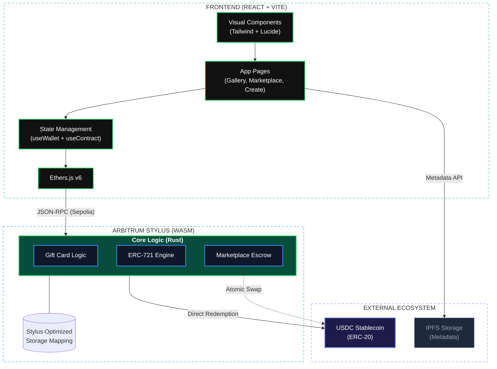
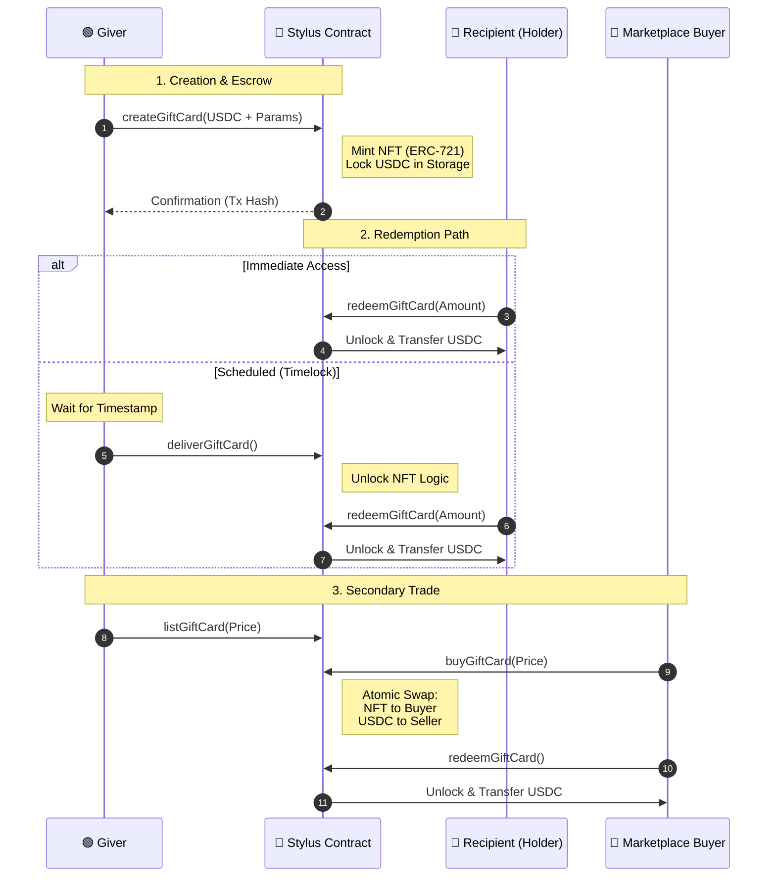

# FlexiGift - Arbitrum Stylus Gift Cards

> On-chain gift cards powered by Rust + Stylus smart contracts on Arbitrum

[](https://arbitrum.io/stylus)
[](https://www.rust-lang.org/)
[](LICENSE)

## 🎯 Problem

Over **20% of gift cards go unused annually**, wasting billions of dollars due to:
- Brand-locked cards
- Expiry dates
- Forgotten balances

## ✨ Solution

FlexiGift uses **Arbitrum Stylus** (Rust → WASM) to create:
- **Smart Gifting** - Send value with a personal touch and timelocks
- **NFT Digital Assets** - Every gift card is a unique, transferable NFT (ERC-721)
- **Auto-refunds** - Unused balances return after expiry
- **10x cheaper gas** - WASM efficiency vs traditional EVM
- **Secondary Market** - Sell unused credits at a discount in the built-in Marketplace

## 🏗️ Architecture

### System Architecture


### Transaction Lifecycle


## 🛠️ Project Modules

### Smart Contracts (Rust + Stylus)
- **GiftCard Core**: Creation, redemption, and lifecycle logic.
- **ERC-721 Engine**: Native NFT implementation for true digital ownership.
- **Marketplace Escrow**: Non-custodial listing and atomic settlement logic.

### Frontend Hub (React + Vite)
- **NFT Dashboard**: Glassmorphic UI for tracking and managing gift card assets.
- **Secondary Market**: P2P interface for browsing and buying discounted cards.
- **Gifting Suite**: Multi-step flow for custom messages and scheduled delivery.

## 🚀 Quick Start

### Prerequisites
```bash 
# Install Rust
curl --proto '=https' --tlsv1.2 -sSf https://sh.rustup.rs | sh

# Set toolchain and add WASM target
rustup default 1.81
rustup target add wasm32-unknown-unknown --toolchain 1.81

# Install cargo-stylus
cargo install --force cargo-stylus
```

### Deploy Contract
```bash
cd contracts

# Check validity
cargo stylus check --endpoint https://sepolia-rollup.arbitrum.io/rpc

# Deploy (requires testnet ETH)
cargo stylus deploy \
  --endpoint https://sepolia-rollup.arbitrum.io/rpc \
  --private-key <YOUR_PRIVATE_KEY>
```

### Run Frontend
```bash
cd frontend
npm install
npm run dev
```

## 📚 Documentation

- [Setup Guide](SETUP.md) - Complete development environment setup
- [Implementation Walkthrough](C:/Users/felix/.gemini/antigravity/brain/3b64ba1f-9ac5-41c2-957f-91b3dfbe54db/walkthrough.md) - Deep dive into feature implementation
- [Stylus Guide](Guides/STYLUS_GUIDE.md) - Smart contract development
- [PRD](Guides/PRD.md) - Product requirements
- [Project Structure](PROJECT_STRUCTURE.md) - Codebase organization

## 🛠️ Technology Stack

| Component | Technology |
|-----------|-----------|
| Smart Contracts | Rust + Stylus SDK |
| Blockchain | Arbitrum Sepolia / Arbitrum One |
| Token Standards | ERC-20 (USDC), ERC-721 (NFT) |
| Frontend | React + Vite + Tailwind CSS |
| UI Icons | Lucide React |
| Web3 | ethers.js v6 |
| Deployment | cargo-stylus CLI |

## 📊 Key Features

- ✅ **NFT Ownership**: Gift cards are true digital assets transferable between wallets
- ✅ **Scheduled Delivery**: Schedule gifts for birthdays/holidays with high-accuracy timestamps
- ✅ **Custom Messaging**: Add heartfelt on-chain notes (up to 280 chars)
- ✅ **Marketplace**: Built-in P2P secondary market for gift card liquidity
- ✅ **Rust Performance**: 10x cheaper gas than Solidity via Stylus WASM execution
- ✅ **Interoperable**: Full compatibility with Solidity contracts
- ✅ **Secure**: Rust's compile-time safety guarantees
- ✅ **Transparent**: All transactions verifiable on-chain
- ✅ **Developer-Friendly**: Comprehensive documentation
- ✅ **Premium UX**: High-end glassmorphic design and real-time state updates

## 🎯 Hackathon Categories

This project targets **3 Arbitrum categories**:
1. **Stylus-based contracts and tools** ✅
2. **Dashboards and developer tools** ✅
3. **Orbit chain experiments** (optional)

## 🔗 Resources

- **Arbitrum Docs**: https://docs.arbitrum.io/
- **Stylus Quickstart**: https://docs.arbitrum.io/stylus/quickstart
- **Stylus SDK**: https://docs.rs/stylus-sdk/
- **Arbitrum Discord**: https://discord.gg/arbitrum
- **Awesome Stylus**: https://github.com/OffchainLabs/awesome-stylus

## 📝 License

MIT

## 🤝 Contributing

Contributions welcome! Please read our contributing guidelines first.

---

**Built with ❤️ on Arbitrum Stylus**
